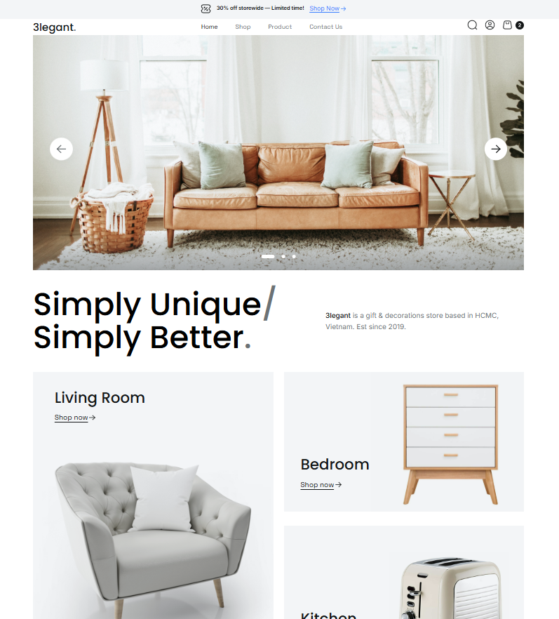

# HTML Landing Pages — Figma Layout Practice

Учебный проект по вёрстке многостраничного сайта на основе макета из Figma.  
Разработан на 1 курсе колледжа как первый опыт работы с HTML, CSS и JavaScript.

---

## О проекте

Проект представляет собой набор адаптивных веб-страниц, сверстанных по дизайн-макету из Figma.

Основная цель — реализовать точное соответствие дизайну и обеспечить корректное отображение сайта на разных устройствах, включая мобильные экраны до 320px.

Figma макет - https://www.figma.com/design/N2mezMI3xf78MDX7C4zmuC/3legant-E-Commerce-UI-Design-Template--Community-?node-id=3-674&t=1m5P9cIRtKyj9mh6-1
---

## Задача проекта

- сверстать сайт по макету Figma
- реализовать адаптивную вёрстку
- обеспечить кроссбраузерную корректность
- познакомиться с базовым JavaScript

---

## Демо


Проект доступен на GitHub Pages:

- 🔗 https://kirikiri2.github.io/project-html/1str.html  
- 🔗 https://kirikiri2.github.io/project-html/2str.html  
- 🔗 https://kirikiri2.github.io/project-html/3str.html  

---

## Функционал

- адаптивная вёрстка (до 320px)
- несколько страниц сайта
- базовая интерактивность с использованием JavaScript
- стилизация с использованием CSS

---

## Технологии

- HTML5
- CSS3
- JavaScript
- GitHub Pages 

---

## Моя роль в проекте

Я самостоятельно:

- сверстала страницы по макету из Figma
- реализовала адаптивность для различных экранов
- написала стили и структуру страниц
- добавила базовую интерактивность с помощью JavaScript
- разместила проект на GitHub Pages

---

## Что решает проект

Проект направлен на отработку навыков фронтенд-разработки:

- перевод дизайна в код
- адаптация интерфейса под разные устройства
- понимание структуры веб-страниц

---

## Чему я научилась

В ходе работы над проектом я:

- изучила основы HTML и CSS
- научилась работать с макетами в Figma
- разобралась с адаптивной вёрсткой (media queries)
- получила первый опыт работы с JavaScript
- освоила деплой проекта на GitHub Pages

---

## Структура проекта
```
project-html/
├── img/
├── 1str.html
├── 2str.html 
├── 3str.html
├── main.css 
├── node-1.js 
├── node-2.js 
```

## Итог

Проект стал основой для дальнейшего изучения frontend-разработки и помог сформировать базовое понимание:

- структуры веб-страниц
- работы с CSS
- адаптивного дизайна
